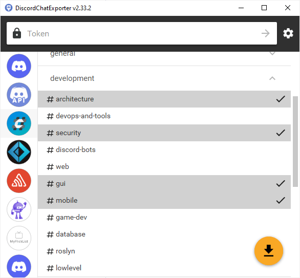

# DiscordChatExporter

<table>
    <tr>
        <td width="99999" align="center">Development of this project is entirely funded by the community. <b><a href="https://tyrrrz.me/donate">Consider donating to support!</a></b></td>
    </tr>
</table>

    

**DiscordChatExporter** is an application that can be used to export message history from any [Discord](https://discord.com) channel to a file.
It works with direct messages, group messages, and server channels, and supports Discord's dialect of markdown as well as most other rich media features.

> ❔ If you have questions or issues, **please refer to the [docs](.docs)**.

> 💬 If you want to chat, **join my [Discord server](https://discord.gg/2SUWKFnHSm)**.

## Terms of use[[?]](https://github.com/Tyrrrz/.github/blob/master/docs/why-so-political.md)

By using this project or its source code, for any purpose and in any shape or form, you grant your **implicit agreement** to all the following statements:

- You **condemn Russia and its military aggression against Ukraine**
- You **recognize that Russia is an occupant that unlawfully invaded a sovereign state**
- You **support Ukraine's territorial integrity, including its claims over temporarily occupied territories of Crimea and Donbas**
- You **reject false narratives perpetuated by Russian state propaganda**

To learn more about the war and how you can help, [click here](https://tyrrrz.me/ukraine). Glory to Ukraine! 🇺🇦

## Download

- **Graphical user interface** (desktop app):
  - 🟢 **[Stable release](https://github.com/Tyrrrz/DiscordChatExporter/releases/latest)**: look for `DiscordChatExporter.*.zip`
  - 🟠 [CI build](https://github.com/Tyrrrz/DiscordChatExporter/actions/workflows/main.yml): look for `DiscordChatExporter.*.zip`
- **Command-line interface** (terminal app):
  - 🟢 **[Stable release](https://github.com/Tyrrrz/DiscordChatExporter/releases/latest)**: look for `DiscordChatExporter.Cli.*.zip`
  - 🟠 [CI build](https://github.com/Tyrrrz/DiscordChatExporter/actions/workflows/main.yml): look for `DiscordChatExporter.Cli.*.zip`
  - 🐋 [Docker](https://hub.docker.com/r/tyrrrz/discordchatexporter): `docker pull tyrrrz/discordchatexporter`
  - 📦 [AUR](https://aur.archlinux.org/packages/discord-chat-exporter-cli): `discord-chat-exporter-cli`
  - 📦 [Nix](https://search.nixos.org/packages?query=discordchatexporter-cli): `discordchatexporter-cli`

> **Note**:
> If you're unsure which build is right for your system, consult with [this page](https://useragent.cc) to determine your OS and CPU architecture.

> **Note**:
> AUR and Nix packages linked above are maintained by the community.
> If you have any issues with them, please contact the corresponding maintainers.

## Features

- Cross-platform graphical and command-line interfaces
- Authentication via either a user or a bot token
- Multiple output formats: HTML (dark/light), TXT, CSV, JSON
- Support for markdown, attachments, embeds, emoji, and other rich media features
- File partitioning, date ranges, message filtering, and other export options
- Self-contained exports that can be viewed offline

## Screenshots

## See also

- [**Chat Analytics**](https://github.com/mlomb/chat-analytics) — solution for analyzing chat patterns of Discord users, using exports produced by **DiscordChatExporter**.
- [**DiscordChatExporter-frontend**](https://github.com/slatinsky/DiscordChatExporter-frontend) — convenient viewer for exports produced by **DiscordChatExporter**.