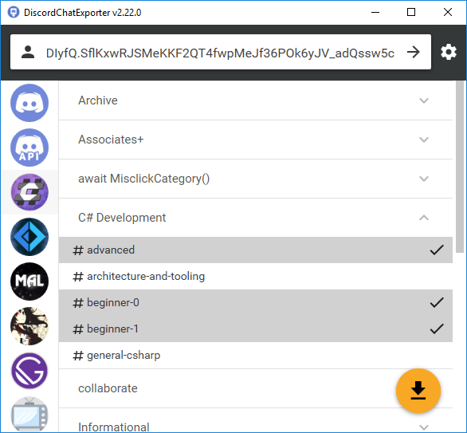
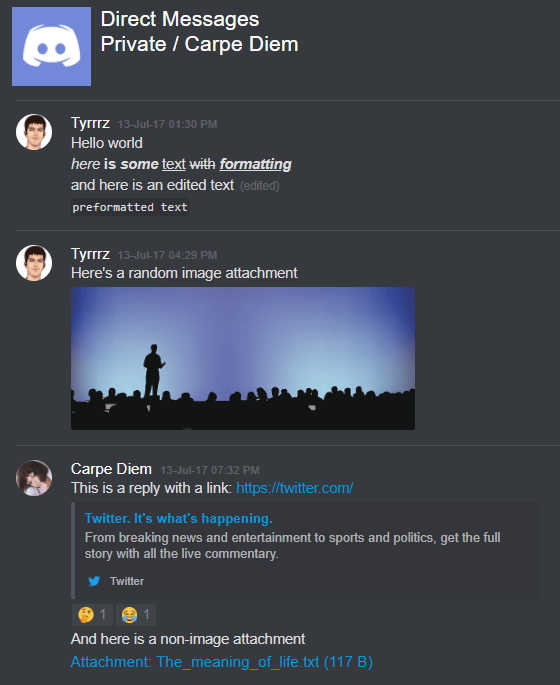

# DiscordChatExporter

[](https://github.com/Tyrrrz/DiscordChatExporter/actions)
[](https://codecov.io/gh/Tyrrrz/DiscordChatExporter)
[](https://github.com/Tyrrrz/DiscordChatExporter/releases)
[](https://github.com/Tyrrrz/DiscordChatExporter/releases)
[](https://discord.gg/2SUWKFnHSm)
[](https://tyrrrz.me/donate)
[](https://twitter.com/Tyrrrz/status/1495972128977571848)

✅ **Project status: active**<sup>[[?]](https://github.com/Tyrrrz/.github/blob/master/docs/project-status.md)</sup>

**DiscordChatExporter** can be used to export message history from a [Discord](https://discord.com) channel to a file.
It works with direct messages, group messages, and server channels, and supports Discord's dialect of markdown as well as all other rich media features.

❓ **If you have questions or issues, please refer to the [wiki](https://github.com/Tyrrrz/DiscordChatExporter/wiki)**

## Terms of use

By using this project or its source code, for any purpose and in any shape or form, you grant your **implicit agreement** to all the following statements:

- You **condemn Russia and its military aggression against Ukraine**
- You **recognize that Russia is an occupant that unlawfully invaded a sovereign state**
- You **support Ukraine's territorial integrity, including its claims over temporarily occupied territories of Crimea and Donbas**
- You **reject false narratives perpetuated by Russian state propaganda**

To learn more about the war and how you can help, [click here](https://tyrrrz.me). Glory to Ukraine! 🇺🇦

## Download

This application comes in two flavors: graphical user interface (**GUI**) and command line interface (**CLI**).
The following table lists all available download options:

<table>
  <thead>
    <tr>
      <th></th>
      <th>Downloads</th>
      <th>Supported OS</th>
    </tr>
  </thead>
  <tbody>
    <tr>
      <td><b>GUI</b></td>
      <td>
        <ul>
          <li>🟢 <b><a href="https://github.com/Tyrrrz/DiscordChatExporter/releases/latest">Stable release</a></b> (<code>DiscordChatExporter.zip</code>)</li>
          <li>🟠 <a href="https://github.com/Tyrrrz/DiscordChatExporter/actions/workflows/CI.yml">CI build</a> (<code>DiscordChatExporter.zip</code>)</li>
        </ul>
      </td>
      <td>
        <ul>
          <li>Windows <b>7</b> or higher</li>
        </ul>
      </td>
    </tr>
    <tr>
      <td><b>CLI</b></td>
      <td>
        <ul>
          <li>🟢 <b><a href="https://github.com/Tyrrrz/DiscordChatExporter/releases/latest">Stable release</a></b> (<code>DiscordChatExporter.CLI.zip</code>) ⚙️</li>
          <li>🟠 <a href="https://github.com/Tyrrrz/DiscordChatExporter/actions/workflows/CI.yml">CI build</a> (<code>DiscordChatExporter.CLI.zip</code>) ⚙️</li>
          <li>🐋 <a href="https://hub.docker.com/r/tyrrrz/discordchatexporter">Docker</a> (<code>tyrrrz/discordchatexporter</code>)</li>
          <li>📦 <a href="https://aur.archlinux.org/packages/discord-chat-exporter-cli">AUR</a> (<code>discord-chat-exporter-cli</code>) 🦄</li>
        </ul>
      </td>
      <td>
        <ul>
          <li>Windows <b>7</b> or higher</li>
          <li>macOS <b>10.13 (High Sierra)</b> or higher</li>
          <li>Linux (multiple distros)</li>
        </ul>
      </td>
    </tr>
  </tbody>
</table>

- ⚙️ - Requires .NET runtime to be installed manually:
  - [.NET v6.0 Runtime for **Windows x64**](https://dotnet.microsoft.com/download/dotnet-core/thank-you/runtime-desktop-6.0.0-windows-x64-installer)
  - [.NET v6.0 Runtime for **Windows x86**](https://dotnet.microsoft.com/download/dotnet-core/thank-you/runtime-desktop-6.0.0-windows-x86-installer)
  - [.NET v6.0 Runtime for **macOS x64**](https://dotnet.microsoft.com/download/dotnet-core/thank-you/runtime-6.0.0-macos-x64-installer)
  - [.NET v6.0 Runtime for **Linux**](https://docs.microsoft.com/en-us/dotnet/core/install/linux) (find your distro)
- 🦄 - Community-maintained resource

## Features

- Graphical user interface (Windows)
- Command line interface (Windows, Linux, macOS)
- Support for both user and bot tokens
- Support for Discord's dialect of markdown
- Support for Discord's message filter syntax
- Support for attachments, embeds, emoji, and other rich media features
- Multiple output formats: HTML (dark/light), TXT, CSV, JSON
- File partitioning, date ranges, and other export options
- Exports messages on the fly without buffering in-memory

## Screenshots




## Building the project locally

Prerequisites:

- [.NET 6.0 SDK](https://dotnet.microsoft.com/download/dotnet/6.0)
- _(Recommended)_ C#/.NET IDE, such as [JetBrains Rider](https://www.jetbrains.com/rider), [VS Code](https://code.visualstudio.com/docs/languages/csharp), or [Visual Studio](https://visualstudio.microsoft.com).

To build the entire solution run the following command in the root of the repository:

```sh
> dotnet build
```

This will generate runtime artifacts for each project:

```plaintext
./DiscordChatExporter.Gui/bin/[Debug|Release]/[runtime]/*
./DiscordChatExporter.Cli/bin/[Debug|Release]/[runtime]/*
```

You can also build and run a specific project directly.
To do that, navigate to its directory and use `dotnet run`:

```sh
> cd DiscordChatExporter.Gui
> dotnet run
```
