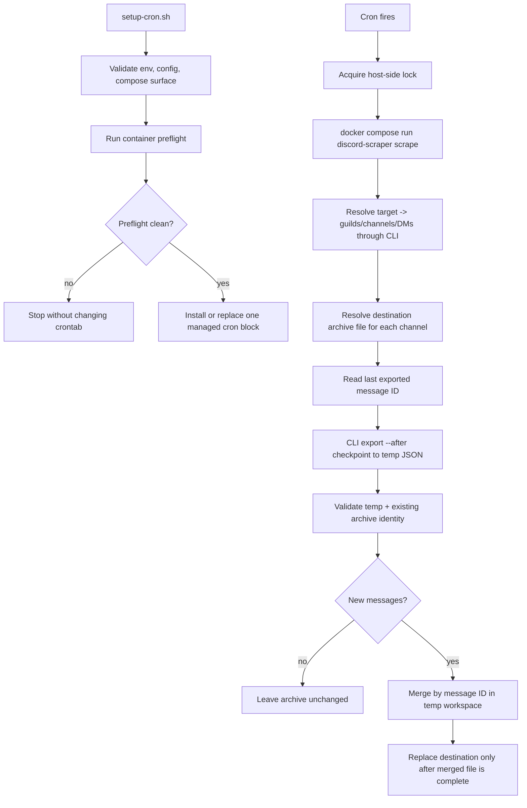

# feat: Add recurring CLI scrape automation

## Summary

Add a CLI-first recurring scrape workflow that builds `DiscordChatExporter.Cli` from source, installs a host-side cron job with safe defaults, and writes exports into the configured `Documents` roots without overwriting previously archived history.

The implementation stays in the shell/Docker wrapper layer rather than changing the core exporter. The core safety guarantee is append-oriented local history preservation: incremental reruns only add newer messages and must fail closed when local state looks ambiguous or unsafe.

---

## Problem Frame

The repo now has a draft Docker/cron wrapper, but the user needs it hardened enough to run with a real token and existing archives. That means the system has to be idempotent at the cron layer, deterministic about which Discord targets map into which output roots, and strict about not corrupting local data even though the upstream CLI itself writes fresh files by default.

---

## Assumptions

*This plan was authored without synchronous user confirmation. The items below are agent inferences that fill gaps in the input — un-validated bets that should be reviewed before implementation proceeds.*

- `DiscordChatExporter.Cli/` in this repo is the source of truth for implementation; the sibling `DiscordChatExporter.Cli.linux-x64` bundle in the parent folder is only a runtime reference point.
- Named target directories should not be allowed to float across unrelated Discord servers; ambiguous guild-name matches should fail until the target is made explicit.
- `--guild` and `--channel` overrides are intended to narrow a configured target, not remap that target to unrelated Discord surfaces.
- Preserving local history is more important than refreshing edits or reactions on already archived older messages.
- Host cron time is the schedule authority; container `TZ` is only for process/runtime timestamp behavior.

---

## Requirements

- R1. Build the recurring scraper from the source repo’s CLI project (`DiscordChatExporter.Cli/`) rather than relying on the downloaded binary bundle.
- R2. Use the configured custom output roots under the user’s `Documents` tree and reject configuration that points outside the approved roots or reuses the same directory for multiple targets.
- R3. Install, update, preview, and remove a single managed cron block idempotently, with a monthly default schedule and CLI options for alternate cadence and target selection.
- R4. For a selected target with no explicit channel list, scrape everything discoverable for that target through the CLI discovery surface (`guilds`, `channels`, `dm`) rather than a separate config-only inventory.
- R5. Preserve previously archived local history by using incremental CLI exports and safe merge semantics instead of overwriting destination exports, even when upstream Discord history has changed or deleted messages are no longer retrievable.
- R6. Fail closed on ambiguous or unsafe state: ambiguous target resolution, invalid destination JSON, mismatched channel identity, missing token/runtime config, or failed preflight must not mutate cron state or corrupt archives.
- R7. Provide a real setup-time validation path that exercises the source-built container and authenticated CLI discovery before the cron job is installed for unattended use.

---

## Scope Boundaries

- No changes to the core C# exporter to add native append semantics; safety stays in the wrapper/runtime layer.
- No attempt to backfill edits, reaction changes, or other mutations on already archived older messages unless a future requirement explicitly asks for that behavior.
- No support for output roots outside the configured `Documents` archive area.
- No new standalone service or daemon; the recurring workflow remains host cron + one-shot container runs.

### Deferred to Follow-Up Work

- CI automation for the new shell/Docker smoke checks if the repo later decides to enforce them on every PR.
- Cross-platform scheduler parity beyond the Linux cron flow already documented in this repo.

---

## Context & Research

### Relevant Code and Patterns

- `DiscordChatExporter.Cli.dockerfile` is the upstream source-build container pattern for the CLI.
- `docker-entrypoint.sh` shows the current container’s ownership and startup assumptions.
- `DiscordChatExporter.Cli/Commands/Base/DiscordCommandBase.cs` defines token handling via `DISCORD_TOKEN`.
- `DiscordChatExporter.Cli/Commands/Base/ExportCommandBase.cs` defines `--after`, output path behavior, and multi-channel export constraints.
- `DiscordChatExporter.Cli/Commands/GetGuildsCommand.cs`, `DiscordChatExporter.Cli/Commands/GetChannelsCommand.cs`, and `DiscordChatExporter.Cli/Commands/GetDirectChannelsCommand.cs` are the authoritative discovery surfaces for accessible guilds, guild channels, and DMs.
- `DiscordChatExporter.Core/Exporting/MessageExporter.cs` confirms the upstream exporter writes fresh files, so append-only behavior must live outside the core writer.
- `DiscordChatExporter.Core/Exporting/ExportRequest.cs` defines output naming and path token rules that the wrapper must either honor or constrain deliberately.
- `.docs/Docker.md` and `.docs/Scheduling-Linux.md` are the existing repo docs for container usage and cron-based scheduling.

### Institutional Learnings

- No relevant `docs/solutions/` or equivalent institutional learning artifacts were found in this repo.

### External References

- None used. Repo-local CLI, Docker, and scheduling docs were sufficient for this plan.

---

## Key Technical Decisions

- **Keep the feature in the wrapper layer:** use the existing CLI as the only export engine and build it from source, instead of modifying the core exporter or introducing a second export path. This keeps behavior aligned with upstream CLI semantics and avoids forking core export logic.
- **Prefer exact target identity over fuzzy convenience:** explicit `guild_ids` remain the strongest configuration, while name-pattern resolution must fail when it cannot resolve to one intended target safely. Wrong-server exports are worse than an operator-visible failure.
- **Treat append-only safety as a hard data-integrity contract:** incremental runs will derive a checkpoint from the existing archive, export newer messages to a temporary file, validate channel identity, merge by message ID, and replace the destination only after a complete merged file exists.
- **Constrain overrides to the selected target:** runtime `--guild` and `--channel` overrides should narrow the configured target’s scope, not redirect that target’s archive root to unrelated Discord surfaces.
- **Use host cron as the scheduler of record:** the cron job owns cadence, overlap protection, and idempotent installation. The container remains a one-shot worker that receives token/config/runtime context from the host environment.
- **Require setup-time preflight before mutating cron:** install should not stop at static file checks; it should prove the source-built container starts correctly and that authenticated CLI discovery works with the configured env before a recurring job is written.

---

## Open Questions

### Resolved During Planning

- **What should happen on ambiguous guild-name matches?** Fail the target instead of exporting all matches.
- **How should `--guild` and `--channel` overrides behave?** They should narrow one selected target only.
- **What is the safety bar for merge writes?** Use recoverable replacement semantics rather than in-place rewrite or best-effort append.
- **What should happen if an existing JSON file belongs to a different channel?** Hard-fail the affected target and leave the existing archive untouched.
- **Should reruns revisit old edited messages?** No; append-only snapshot preservation wins unless a later requirement changes that.
- **Which timezone governs the monthly default?** The host cron schedule does; container timezone is informational/runtime only.

### Deferred to Implementation

- **How deep should authenticated setup preflight go by default?** The implementer should choose the safest proof path after wiring the container end-to-end: prefer discovery-only validation if it gives enough confidence, but allow a disposable sandbox export if discovery alone cannot prove the scrape path.
- **How should shell smoke coverage be executed in this repo?** The implementer should decide whether the new shell checks live as standalone scripts only or are also wrapped by an existing repo test entrypoint if one emerges during execution.

---

## High-Level Technical Design

> *This illustrates the intended approach and is directional guidance for review, not implementation specification. The implementing agent should treat it as context, not code to reproduce.*

---

## Implementation Units

### U1. Lock down the target and config contract

**Goal:** Make target selection deterministic and safe so each configured archive root only accepts the intended Discord surfaces.

**Requirements:** R2, R4, R6

**Dependencies:** None

**Files:**
- Modify: `config/scrape-targets.json`
- Modify: `scripts/run-discord-scrape.sh`
- Modify: `scripts/setup-cron.sh`
- Create: `scripts/tests/run-discord-scrape-smoke.sh`
- Create: `scripts/tests/test-fixtures/`

**Approach:**
- Define the supported recurring-scrape config fields explicitly and reject unsupported or unsafe values instead of silently ignoring them.
- Enforce that configured `output_dir` values stay under the approved archive root and remain unique across targets.
- Tighten target resolution so explicit IDs win, name-pattern resolution fails when it is ambiguous, and runtime overrides can only narrow one selected target.
- Normalize failure handling so invalid config or target mapping errors stop the affected setup/run path before any archive mutation.

**Execution note:** Start with characterization-style smoke coverage for target selection and config validation before tightening behavior in the scripts.

**Patterns to follow:**
- `DiscordChatExporter.Cli/Commands/GetGuildsCommand.cs`
- `DiscordChatExporter.Cli/Commands/GetChannelsCommand.cs`
- `DiscordChatExporter.Cli/Commands/GetDirectChannelsCommand.cs`
- `.docs/Scheduling-Linux.md`

**Test scenarios:**
- Happy path: a target with explicit `guild_ids` resolves only that guild’s channels and keeps the configured archive root.
- Happy path: the DM target resolves all accessible DM channels when no explicit channel list is configured.
- Edge case: a target with zero guild-name matches fails that target cleanly without mutating unrelated targets.
- Edge case: a target with multiple guild-name matches fails closed and reports the ambiguity.
- Error path: duplicate `output_dir` values across targets are rejected before cron install or scrape execution.
- Error path: an override channel or guild outside the selected target’s allowed scope is rejected.
- Integration: repeated validation runs against the same config produce the same resolved target set and do not create extra state files.

**Verification:**
- Invalid target/config state is surfaced before cron or archive writes occur.
- A selected target always maps to one predictable archive root and one intended Discord surface set.

---

### U2. Enforce append-only archive safety in the scrape wrapper

**Goal:** Make recurring runs preserve already-downloaded local history while still importing newer messages safely.

**Requirements:** R4, R5, R6

**Dependencies:** U1

**Files:**
- Modify: `scripts/run-discord-scrape.sh`
- Create: `scripts/tests/run-discord-scrape-smoke.sh`
- Create: `scripts/tests/test-fixtures/append-existing.json`
- Create: `scripts/tests/test-fixtures/append-incremental.json`
- Create: `scripts/tests/test-fixtures/wrong-channel.json`

**Approach:**
- Keep the CLI export path authoritative, but derive an incremental checkpoint from the existing archive before each rerun.
- Write incremental exports and merged results in temporary locations on the same filesystem as the destination archive.
- Validate that an existing archive’s embedded channel metadata matches the channel being updated before any merge occurs.
- Merge message arrays by message ID and preserve pre-existing local history when newer incremental exports omit older or deleted upstream content.
- Adopt one consistent local-state failure policy: fail the affected target, leave the destination file unchanged, and continue only unrelated targets.

**Patterns to follow:**
- `DiscordChatExporter.Core/Exporting/MessageExporter.cs`
- `DiscordChatExporter.Core/Exporting/ExportRequest.cs`
- `DiscordChatExporter.Cli.Tests/Specs/DateRangeSpecs.cs`

**Test scenarios:**
- Happy path: a first-time scrape creates a new JSON archive for a channel.
- Happy path: a rerun with newer messages appends only the new messages and keeps previously archived older messages intact.
- Edge case: a rerun with zero newer messages leaves the destination archive unchanged.
- Edge case: overlapping incremental data is deduplicated by message ID instead of producing duplicate messages.
- Error path: invalid destination JSON aborts the affected target without replacing the archive.
- Error path: a destination archive whose embedded channel identity does not match the requested channel aborts the affected target without replacement.
- Integration: a fixture that removes older messages from the incremental file still produces a merged archive containing the original older history.

**Verification:**
- Repeated reruns never truncate the existing `messages` history for a valid archive.
- Unsafe local state causes a visible failure without replacing the destination archive.

---

### U3. Align the source-built container and runtime preflight path

**Goal:** Make the container/runtime layer reflect the CLI-only source build, mounted archive roots, and token/config contract needed for safe recurring operation.

**Requirements:** R1, R2, R6, R7

**Dependencies:** U1

**Files:**
- Modify: `Dockerfile`
- Modify: `docker-compose.yml`
- Modify: `scrape.env.example`
- Modify: `.gitignore`
- Create: `scripts/tests/container-smoke.sh`

**Approach:**
- Keep the runtime image focused on the CLI wrapper surface and source-build `DiscordChatExporter.Cli` inside the Docker image.
- Prefer environment-based token injection over committed files or inline command flags.
- Mount only the archive area and config surface needed for recurring runs, avoiding container startup behaviors that could recursively rewrite ownership across the whole archive tree.
- Make config discovery deterministic: mounted repo config should win when present, with a built-in fallback only to keep the wrapper executable when the mount is absent.
- Add a preflight surface that proves the image, wrapper, and config visibility are working before cron is installed.

**Patterns to follow:**
- `DiscordChatExporter.Cli.dockerfile`
- `docker-entrypoint.sh`
- `.docs/Docker.md`

**Test scenarios:**
- Happy path: the image builds from source and the wrapper can render help/list configured targets successfully.
- Happy path: the container sees the mounted config and archive root expected by the recurring scripts.
- Edge case: missing `DISCORD_TOKEN` fails fast with a clear message and no archive writes.
- Error path: missing or invalid config visibility fails predictably instead of silently falling back to an unsafe runtime state.
- Integration: a preflight container run exercises source-built startup and authenticated discovery without mutating the user’s existing archive roots.

**Verification:**
- The Docker/compose layer is source-built, token-driven, and consistent with the recurring wrapper contract.
- Container startup does not perform broad archive permission rewrites as a side effect.

---

### U4. Make cron installation idempotent and safe to rerun

**Goal:** Ensure setup can be run repeatedly with real credentials and evolving target selections without duplicating cron entries or masking broken runtime state.

**Requirements:** R3, R6, R7

**Dependencies:** U1, U3

**Files:**
- Modify: `scripts/setup-cron.sh`
- Create: `scripts/tests/setup-cron-smoke.sh`
- Modify: `.docs/Scheduling-Linux.md`

**Approach:**
- Keep one managed cron block identified by stable markers, preserving unrelated crontab entries.
- Treat `--dry-run`, install/update, and `--remove` as the same managed block lifecycle rather than separate code paths with drift.
- Use a host-side lock in the scheduled command to avoid overlapping runs from cron.
- Run setup-time preflight before mutating crontab state unless the caller is previewing or removing.
- Improve operator-facing output so no-op health, validation failures, and install success are distinguishable.

**Patterns to follow:**
- `.docs/Scheduling-Linux.md`
- Existing `scripts/setup-cron.sh`

**Test scenarios:**
- Happy path: a default install generates one monthly cron entry at the expected managed marker block.
- Happy path: rerunning setup with new schedule or target options replaces only the managed block and preserves unrelated crontab lines.
- Edge case: `--dry-run` previews the exact managed block without touching the live crontab.
- Edge case: `--remove` deletes only the managed block and leaves unrelated entries intact.
- Error path: failed preflight leaves the crontab unchanged.
- Integration: a fixture crontab exercised through install -> reinstall -> remove remains stable and idempotent across the full lifecycle.

**Verification:**
- Repeated setup runs converge to one managed cron block.
- Cron is never mutated after a failed validation/preflight pass.

---

### U5. Publish the operator contract for the recurring scraper

**Goal:** Align repo docs with the new recurring CLI wrapper so operators know the supported config keys, safety rules, and live setup expectations.

**Requirements:** R2, R3, R5, R7

**Dependencies:** U2, U4

**Files:**
- Modify: `.docs/Docker.md`
- Modify: `.docs/Scheduling-Linux.md`
- Modify: `Readme.md`

**Approach:**
- Document that the recurring workflow is CLI-first, source-built, and configured through the wrapper-owned env/config files rather than a native DCE config surface.
- Explain the append-only contract clearly: new messages are merged in, existing local history is retained, and older edits/reactions are not backfilled.
- Document the approved archive-root rule, target selection behavior, and the host-timezone interpretation of cron schedules.
- Add a short “first authenticated setup” path so the operator can run the safe preflight and understand what success vs no-op vs failure looks like.

**Patterns to follow:**
- `.docs/Docker.md`
- `.docs/Scheduling-Linux.md`
- `.docs/Using-the-CLI.md`

**Test scenarios:**
- Test expectation: none -- documentation-only unit. Review should confirm that documented flags, defaults, and safety constraints match the implemented wrapper behavior.

**Verification:**
- The docs describe the same config keys, schedule behavior, and safety limits that the scripts actually enforce.

---

## System-Wide Impact

- **Interaction graph:** host cron, `docker compose`, the wrapper scripts, the source-built CLI binary, and the on-disk JSON archives all participate in each recurring run.
- **Error propagation:** config/setup failures should stop before crontab mutation; target-level local-state failures should stop that target without silently replacing archives; unrelated targets may continue when safe.
- **State lifecycle risks:** channel-map state, destination archives, and temporary merge files must stay coherent across repeated runs and interrupted execution.
- **API surface parity:** the recurring wrapper must stay aligned with the existing CLI discovery/export surface rather than inventing a second target-resolution contract.
- **Integration coverage:** source-built container startup, authenticated discovery, archive merge safety, and crontab lifecycle need smoke coverage beyond existing C# export tests.
- **Unchanged invariants:** the upstream CLI remains the exporter of record; this plan does not change the core C# export writer’s overwrite semantics, only how recurring automation uses it safely.

---

## Risks & Dependencies

| Risk | Mitigation |
|------|------------|
| Ambiguous guild-name matching routes data into the wrong archive root | Fail the target unless resolution is explicit and unique; prefer configured IDs over fuzzy matches |
| Append-only merge logic corrupts an existing archive on bad local state | Validate destination JSON and embedded channel identity before merge; replace only after a complete merged file exists |
| Cron install succeeds even though runtime auth/config is broken | Require setup-time preflight before mutating crontab state |
| Broad container ownership or mount behavior touches the archive tree unexpectedly | Keep runtime mounts narrow and avoid recursive ownership rewrites across the archive root |
| Operators misread “no new messages” as failure | Standardize logs and summaries for success, no-op, skipped target, and failure outcomes |

---

## Documentation / Operational Notes

- The recurring workflow should continue to rely on `DISCORD_TOKEN` through env-file or shell environment, not committed token material.
- The host cron schedule is the timing authority; container `TZ` should only influence runtime formatting/log interpretation.
- The sibling `DiscordChatExporter.Cli.linux-x64` bundle may be useful as a runtime comparison point during execution, but the implementation target remains the source repo’s CLI project.

---

## Sources & References

- Related code: `DiscordChatExporter.Cli.dockerfile`
- Related code: `docker-entrypoint.sh`
- Related code: `DiscordChatExporter.Cli/Commands/Base/DiscordCommandBase.cs`
- Related code: `DiscordChatExporter.Cli/Commands/Base/ExportCommandBase.cs`
- Related code: `DiscordChatExporter.Cli/Commands/GetGuildsCommand.cs`
- Related code: `DiscordChatExporter.Cli/Commands/GetChannelsCommand.cs`
- Related code: `DiscordChatExporter.Cli/Commands/GetDirectChannelsCommand.cs`
- Related code: `DiscordChatExporter.Core/Exporting/MessageExporter.cs`
- Related code: `DiscordChatExporter.Core/Exporting/ExportRequest.cs`
- Related docs: `.docs/Docker.md`
- Related docs: `.docs/Scheduling-Linux.md`
- Related docs: `.docs/Using-the-CLI.md`
